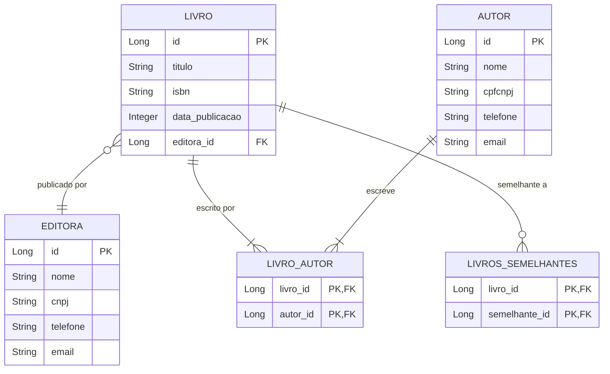

# 8. Banco de Dados

Esta seção descreve o modelo de dados da aplicação, detalhando as principais tabelas e os relacionamentos entre elas. A persistência de dados é gerenciada pelo Hibernate, utilizando o padrão JPA.

## 8.1. Modelo de Entidade-Relacionamento

O modelo de dados é composto por três entidades principais: `Livro`, `Autor` e `Editora`.

## 8.2. Explicação das Tabelas

### Tabela `livros`

Armazena as informações sobre os livros do acervo.

| Coluna            | Tipo         | Descrição                                      |
| ----------------- | ------------ | ---------------------------------------------- |
| `id`              | `BIGINT`     | Chave primária (auto-incremento).              |
| `titulo`          | `VARCHAR(500)` | Título do livro.                               |
| `isbn`            | `VARCHAR(20)`  | Código ISBN único do livro.                    |
| `data_publicacao` | `INTEGER`    | Ano de publicação do livro.                    |
| `editora_id`      | `BIGINT`     | Chave estrangeira para a tabela `editoras`.    |

### Tabela `autores`

Armazena os dados dos autores dos livros.

| Coluna   | Tipo          | Descrição                                      |
| -------- | ------------- | ---------------------------------------------- |
| `id`     | `BIGINT`      | Chave primária (auto-incremento).              |
| `nome`   | `VARCHAR(100)`| Nome do autor.                                 |
| `cpfcnpj`| `VARCHAR(18)` | CPF ou CNPJ do autor.                          |
| `telefone`| `VARCHAR(15)` | Telefone de contato.                           |
| `email`  | `VARCHAR(100)`| Email de contato.                              |

### Tabela `editoras`

Armazena os dados das editoras dos livros.

| Coluna   | Tipo          | Descrição                                      |
| -------- | ------------- | ---------------------------------------------- |
| `id`     | `BIGINT`      | Chave primária (auto-incremento).              |
| `nome`   | `VARCHAR(100)`| Nome da editora.                               |
| `cnpj`   | `VARCHAR(14)` | CNPJ da editora.                               |
| `telefone`| `VARCHAR(15)` | Telefone de contato.                           |
| `email`  | `VARCHAR(100)`| Email de contato.                              |

### Tabelas de Junção

- **`livro_autor`**: Tabela associativa que implementa o relacionamento N-M (muitos-para-muitos) entre `livros` e `autores`.
  - `livro_id`: Chave estrangeira para `livros.id`.
  - `autor_id`: Chave estrangeira para `autores.id`.

- **`livros_semelhantes`**: Tabela associativa que implementa o relacionamento N-M autorreferenciado da entidade `livros`.
  - `livro_id`: Chave estrangeira para o livro principal.
  - `semelhante_id`: Chave estrangeira para o livro considerado semelhante.